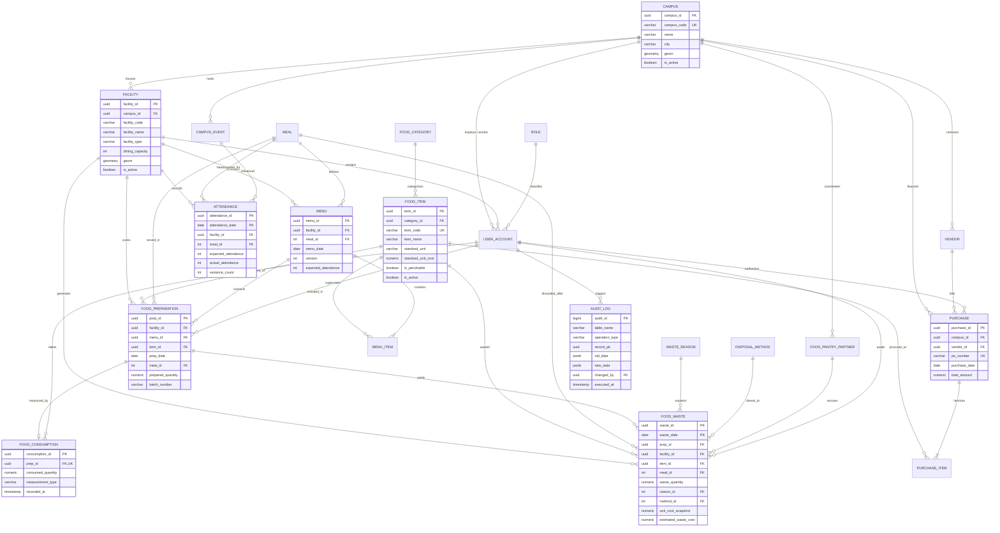

# Entity-Relationship (ER) Diagram
## Campus Food Waste Intelligence System (CFWIS)

```mermaid
erDiagram
    CAMPUS ||--o{ FACILITY : "houses"
    CAMPUS ||--o{ USER_ACCOUNT : "employs / enrolls"
    CAMPUS ||--o{ VENDOR : "contracts"
    CAMPUS ||--o{ PURCHASE : "finances"
    CAMPUS ||--o{ CAMPUS_EVENT : "hosts"
    CAMPUS ||--o{ FOOD_PANTRY_PARTNER : "coordinates"

    FACILITY ||--o{ MENU : "schedules"
    FACILITY ||--o{ ATTENDANCE : "records"
    FACILITY ||--o{ FOOD_PREPARATION : "cooks"
    FACILITY ||--o{ FOOD_WASTE : "generates"
    FACILITY ||--o{ USER_ACCOUNT : "assigns"

    ROLE ||--o{ USER_ACCOUNT : "classifies"

    FOOD_CATEGORY ||--o{ FOOD_ITEM : "categorizes"

    FOOD_ITEM ||--o{ MENU_ITEM : "included_in"
    FOOD_ITEM ||--o{ FOOD_PREPARATION : "ingredient_of"
    FOOD_ITEM ||--o{ FOOD_WASTE : "wasted"
    FOOD_ITEM ||--o{ PURCHASE_ITEM : "procured_as"

    MEAL ||--o{ MENU : "defines"
    MEAL ||--o{ ATTENDANCE : "headcounted_for"
    MEAL ||--o{ FOOD_PREPARATION : "served_in"
    MEAL ||--o{ FOOD_WASTE : "discarded_after"

    MENU ||--|{ MENU_ITEM : "contains"
    MENU ||--o{ FOOD_PREPARATION : "instructs"

    FOOD_PREPARATION ||--o| FOOD_CONSUMPTION : "measured_by"
    FOOD_PREPARATION ||--o{ FOOD_WASTE : "yields"

    WASTE_REASON ||--o{ FOOD_WASTE : "explains"
    DISPOSAL_METHOD ||--o{ FOOD_WASTE : "diverts_to"
    FOOD_PANTRY_PARTNER ||--o{ FOOD_WASTE : "rescues"

    VENDOR ||--o{ PURCHASE : "bills"
    PURCHASE ||--|{ PURCHASE_ITEM : "itemizes"

    CAMPUS_EVENT ||--o{ ATTENDANCE : "influences"

    USER_ACCOUNT ||--o{ AUDIT_LOG : "triggers"
    USER_ACCOUNT ||--o{ FOOD_PREPARATION : "supervises"
    USER_ACCOUNT ||--o{ FOOD_CONSUMPTION : "tallies"
    USER_ACCOUNT ||--o{ FOOD_WASTE : "audits"
    USER_ACCOUNT ||--o{ PURCHASE : "authorizes"

    CAMPUS {
        uuid campus_id PK
        varchar campus_code UK
        varchar name
        varchar city
        geometry geom
        boolean is_active
    }

    FACILITY {
        uuid facility_id PK
        uuid campus_id FK
        varchar facility_code
        varchar facility_name
        varchar facility_type
        int dining_capacity
        geometry geom
        boolean is_active
    }

    FOOD_ITEM {
        uuid item_id PK
        uuid category_id FK
        varchar item_code UK
        varchar item_name
        varchar standard_unit
        numeric standard_unit_cost
        boolean is_perishable
        boolean is_active
    }

    MENU {
        uuid menu_id PK
        uuid facility_id FK
        int meal_id FK
        date menu_date
        int version
        int expected_attendance
    }

    FOOD_PREPARATION {
        uuid prep_id PK
        uuid facility_id FK
        uuid menu_id FK
        uuid item_id FK
        date prep_date
        int meal_id FK
        numeric prepared_quantity
        varchar batch_number
    }

    FOOD_CONSUMPTION {
        uuid consumption_id PK
        uuid prep_id FK,UK
        numeric consumed_quantity
        varchar measurement_type
        timestamp recorded_at
    }

    FOOD_WASTE {
        uuid waste_id PK
        date waste_date PK
        uuid prep_id FK
        uuid facility_id FK
        uuid item_id FK
        int meal_id FK
        numeric waste_quantity
        int reason_id FK
        int method_id FK
        numeric unit_cost_snapshot
        numeric estimated_waste_cost
    }

    ATTENDANCE {
        uuid attendance_id PK
        date attendance_date PK
        uuid facility_id FK
        int meal_id FK
        int expected_attendance
        int actual_attendance
        int variance_count
    }

    PURCHASE {
        uuid purchase_id PK
        uuid campus_id FK
        uuid vendor_id FK
        varchar po_number UK
        date purchase_date
        numeric total_amount
    }

    AUDIT_LOG {
        bigint audit_id PK
        varchar table_name
        varchar operation_type
        uuid record_pk
        jsonb old_data
        jsonb new_data
        uuid changed_by FK
        timestamp executed_at
    }
```
